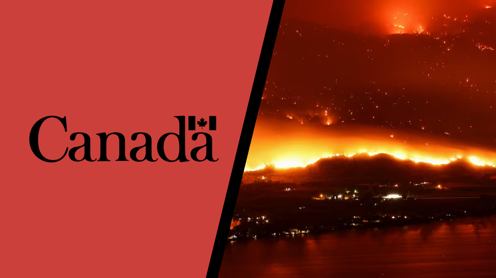

# Satellite Imagery Wildfire Detection Model

Credits: [CBC](https://www.cbc.ca/radio/ideas/world-on-fire-canada-s-worst-wildfire-season-on-record-1.6946472) + [Logos-World](https://logos-world.net/government-of-canada-logo/)

## Overview
This project uses satellite imagery to predict whether a specific area is at risk of a wildfire. Using a deep learning model trained on a dataset of satellite images, the model classifies areas as either having a wildfire (positive class) or not having a wildfire (negative class). The dataset was sourced from Canada's Open Government Portal, and the goal is to create a system capable of providing early warnings for wildfire events.

## Objectives
- **Primary Objective:** Build a model that can predict if an area is at risk of a wildfire based on satellite imagery.
- **Secondary Objective:** Enable real-time wildfire detection and alert systems for emergency responders and forest management teams.

## Dataset

### Source

Refer to Canada's website for the original wildfires data:
Forest Fires - Open Government Portal

Original license for the data:
Creative Commons 4.0 Attribution (CC-BY) license – Quebec

### About Dataset

This dataset contains satellite images (350x350px) in 2 classes :

- Wildfire : 22710 images
- No wildfire : 20140 images

The data was divided into train, test and validation with these percentages :

- Train : ~70%
- Test : ~15%
- Validation : ~15%

### How was the dataset created

Using Longitude and Latitude coordinates for each wildfire spot (> 0.01 acres burned) found on the dataset above we extracted satellite images of those areas using MapBox API to create a more convenient format of the dataset for deep learning and building a model that can predict whether an area is at risk of a wildfire or not

- Dataset on Kaggle: [Wildfire Prediction Dataset (Satellite Images)](https://www.kaggle.com/datasets/abdelghaniaaba/wildfire-prediction-dataset/data) 

## Data Preprocessing

The data preprocessing steps include:
- Loading and resizing the satellite images to a uniform size of **32x32 pixels**.
- Normalizing pixel values to be between 0 and 1.
- Splitting the dataset into training, validation, and test sets.

## Model Training

### Optimizer and Loss Function
The model was trained using the **Adam optimizer** and **binary cross-entropy loss**. These choices were selected for their effectiveness in training deep learning models for binary classification tasks.

### Early Stopping
To prevent overfitting, **early stopping** was employed with a patience of 4 epochs. This means the training would stop if the validation loss did not improve for 4 consecutive epochs.

### Training Details:
- **Epochs**: 20
- **Batch size**: 64
- **Optimizer**: Adam
- **Loss function**: Binary Cross-Entropy
- **Early stopping**: Patience of 4 epochs

The model's performance was tracked using **accuracy** and **loss** metrics for both training and validation datasets.

## Testing and Validation

### Model Evaluation:
After training, the model was evaluated on both the **validation** and **test datasets** to assess how well it generalizes to unseen data.

#### **Validation:**
The model's performance on the validation set was monitored throughout training. Validation accuracy and loss were recorded after each epoch to ensure the model wasn't overfitting to the training data. Early stopping was used to prevent overfitting and allow the model to generalize better.

#### **Test Set Evaluation:**
The final evaluation on the test set provided an unbiased measure of the model’s accuracy and effectiveness in distinguishing wildfire from non-wildfire images. The model achieved an **accuracy of 94.67%** on the test dataset.

### Confusion Matrix
The confusion matrix was calculated for the train, validation, and test datasets to visualize the performance of the model in terms of true positives, true negatives, false positives, and false negatives.

- **Training Set Confusion Matrix:**
  - High precision and recall for both classes, with an overall accuracy of 95%.

- **Validation Set Confusion Matrix:**
  - Strong accuracy (94%) and good class separation.

- **Test Set Confusion Matrix:**
  - The test set evaluation resulted in an accuracy of **94.67%** and showed good performance in identifying both wildfire and non-wildfire images.

### Classification Report for Test Data:

| Class           | Precision | Recall | F1-Score | Support |
|-----------------|-----------|--------|----------|---------|
| **Non-wildfire** | 0.91      | 0.98   | 0.94     | 2820    |
| **Wildfire**     | 0.98      | 0.92   | 0.95     | 3480    |
| **Accuracy**     |           |        | **0.95** | 6300    |
| **Macro Avg**    | 0.95      | 0.95   | 0.95     | 6300    |
| **Weighted Avg** | 0.95      | 0.95   | 0.95     | 6300    |

- **Precision (Non-wildfire)**: 91% of predicted non-wildfire images were correctly classified as non-wildfire.
- **Recall (Non-wildfire)**: 98% of actual non-wildfire images were correctly identified.
- **Precision (Wildfire)**: 98% of predicted wildfire images were correctly classified as wildfire.
- **Recall (Wildfire)**: 92% of actual wildfire images were correctly identified.

### Interpretation:
- **Class 0 (Non-wildfire)**: High precision (91%) and recall (98%), resulting in a solid F1-score of 0.94.
- **Class 1 (Wildfire)**: Excellent precision (98%) and recall (92%), with an F1-score of 0.95.

Overall, the model demonstrates strong performance with **94.67% test accuracy**, effectively distinguishing between wildfire and non-wildfire events. Both precision and recall are balanced across both classes, showing the model's ability to avoid both false positives and false negatives.

## Next Steps

1. **Model Deployment**:
   - Deploy the model for real-time inference or batch processing in a cloud or edge platform.
   - Create an API for easy integration with satellite image data sources and monitoring systems.

2. **Integration with Satellite Data**:
   - Integrate the model with satellite data processing pipelines (e.g., from Landsat, Sentinel).
   - Preprocess incoming satellite images (resizing, normalization) before passing them to the model.

3. **Real-time Monitoring and Alerts**:
   - Develop an alert system to notify relevant stakeholders (e.g., forest rangers, emergency responders) when wildfires are detected.
   - Integrate model predictions with GIS systems to visualize wildfire locations and potential risk zones.

4. **Model Improvements**:
   - Periodically retrain the model with new satellite data to improve performance and maintain accuracy.
   - Implement active learning strategies to improve the model based on uncertain predictions and human feedback.

5. **Field Testing**:
   - Deploy the model in specific regions for field testing, gather feedback from real-world users (e.g., forest rangers), and fine-tune the model to reduce false positives/negatives.

6. **Scaling the Model**:
   - Explore scaling the model for global wildfire detection by incorporating more satellite data sources and expanding the dataset.
   - Investigate possible applications for other environmental monitoring tasks, such as deforestation detection or disaster response.

## Conclusion
This model offers a powerful approach to wildfire detection using satellite imagery. With strong performance on test data (94.67% accuracy), it has the potential to be deployed in real-time monitoring systems to support wildfire detection and response efforts. Future improvements and integrations will further enhance its capabilities.
